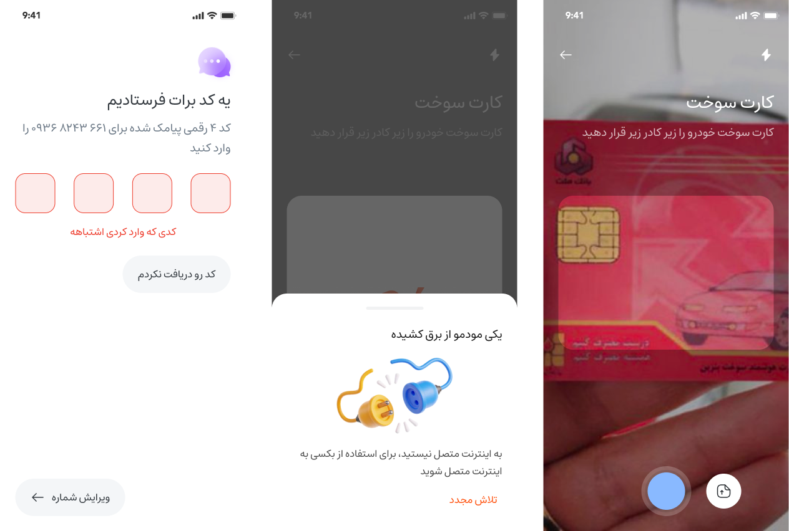
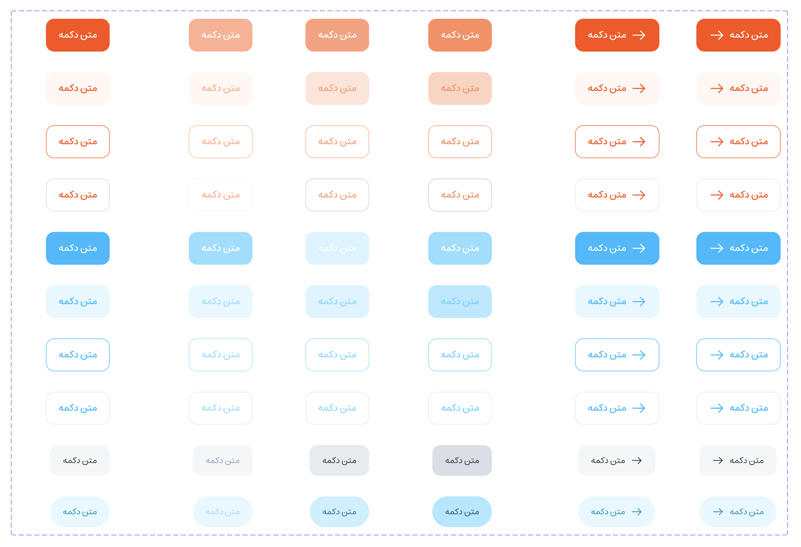
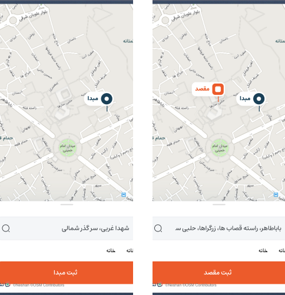

# Frontend

- **Authentication Provider:** a provider for authentication required routes from react-router, storing and accessing auth tokens safe, easy, flexible, and secure
- **Private Axios Hook:** an instance of Axios for sending API requests to authentication-required endpoints wrapping the requests in secure cookies and sending the credentials:
    -  **Request Interceptor:** Using request interceptors we simplified our work in working with sending auth-required requests and including credentials just once and using it everywhere:)
    -  **Response Interceptor:** Using response interceptors we minified our work in working with auth-required routes, and pages and accessing tokens easily

- **Design System and Components:** Implementing our UI Design, We Started with designing Our Design System based on atomic design (regarding Brad Frost) and making our process of developing front-end, changing or editing UI components or logic later on, easier and more integrated code. Our Design system is not complete yet but it does have a good start.
    -  **Buttons:** We have `primary` `secondary` `tonal` `outline` `text` buttons as an example with one single component, a typography system, and a responsive grid.
    -  **Inputs:** We applied padding, spacing, typeface, corner radius, and several states of inputs into our input component simplifying our job
    -  **Modal Providers:** We needed to show models such as no network modal anywhere inside our application, so we used react context API and simply wrapped our application and routers inside it
    -  **Map View:** We used OpenLayers Map and to be honest it was such a low-level library that we had to define and implement each interaction with user touch or mouse cursor change events, for the location picker from the experience users have from other e-taxi services we had to implement each interaction and listen to event listeners to change the location and modification of the marker.

      

## How to Run Docker
To get Baxi up and running in a docker container, follow these steps:

1. **Clone the Repository:** `git clone https://github.com/salehsoleimani/baxi-client`
2. **Build the Docker Image:** `Make build`
3. **Run the Docker Container:** `Make run`

## How to Run in Local
To get Baxi up and running in your local environment, follow these steps:

1. **Clone the Repository:** `git clone https://github.com/salehsoleimani/baxi-client`
8. **Install the packages:** `npm install`
9. **Run or Build the Client Server:** `npm start`
